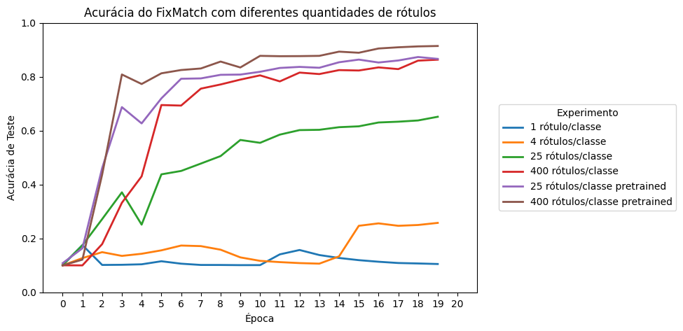

# Tarefa 3 - Implementação do FixMatch com Pytorch

Alunos: Kauan Mariani Ferreira, Pedro Henrique Coterli e Samuel Corrêa Lima

Link para o vídeo com a apresentação: https://www.youtube.com/watch?v=0BMUgv4YzwM

Este repositório contém uma implementação compacta do algoritmo FixMatch usando PyTorch. O objetivo é servir como material didático e como referência prática para entender e reproduzir as etapas fundamentais do método.

## Arquivos no repositório:

fixmatch_algorithm.ipynb — Notebook com a implementação principal, visualizações e experimentos. Também hospedado no Kaggle: https://www.kaggle.com/code/kauanmf/fixmatch-algorithm-final

dl_tarefa_3.pdf — Slides utilizados no vídeo (material de apoio).

---

# Descrição do Experimento FixMatch

Este documento descreve a implementação e os resultados do algoritmo FixMatch, um método de aprendizado semi-supervisionado, aplicado ao dataset CIFAR-10. O código-fonte principal está no arquivo `fixmatch-algorithm.py`.

## 1. Objetivo do Experimento

O objetivo principal foi avaliar a eficácia do FixMatch em cenários com quantidades muito limitadas de dados rotulados. Foram conduzidos múltiplos experimentos variando o número de amostras rotuladas por classe e comparando o treinamento de um modelo do zero com o uso de um modelo pré-treinado. Como pode ser visto no pipeline abaixo.

## 2. Pipeline

### a. Dataset e Preparação dos Dados

- **Dataset**: Foi utilizado o **CIFAR-10**.
- **Divisão dos Dados**: O conjunto de treino foi dividido em duas partes: um pequeno subconjunto **rotulado** e um grande subconjunto **não rotulado**. A função `get_ssl_indices` foi responsável por essa divisão, garantindo um número específico de amostras por classe para o conjunto rotulado (e.g., 1, 4, 25, 400).

### b. Aumentação de Dados (Data Augmentation)

Uma parte central do FixMatch é o uso de duas estratégias de aumentação distintas:

- **Aumentação Fraca (`transform_weak`)**: Aplica transformações simples como flips horizontais e recortes aleatórios. É usada para gerar as predições (pseudo-labels) nos dados não rotulados e para treinar com os dados rotulados.
- **Aumentação Forte (`transform_strong`)**: Além das transformações fracas, aplica políticas de aumentação mais agressivas, como `RandAugment` e `RandomErasing`. É usada para forçar o modelo a manter a consistência em suas predições, mesmo com imagens muito distorcidas.

### c. Arquitetura do Modelo

Foram utilizadas duas arquiteturas baseadas na ResNet:

1.  **ResNet (Custom)**: Uma implementação da ResNet (`BasicBlock`) treinada do zero.
2.  **ResNet Pré-treinada (`ResNetPretreined`)**: Uma ResNet-18 pré-treinada no dataset ImageNet, com a camada de classificação final adaptada para as 10 classes do CIFAR-10.

### d. Função de Perda FixMatch (`fixmatch_loss`)

A perda total é a soma de duas componentes:

1.  **Perda Supervisionada (`loss_supervised`)**: Uma `CrossEntropyLoss` padrão, calculada sobre o pequeno lote de dados rotulados.
2.  **Perda Não Supervisionada (`loss_unsupervised`)**:
    - O modelo faz uma predição em uma versão **fracamente aumentada** de uma imagem não rotulada.
    - Se a confiança dessa predição (a probabilidade máxima) for maior que um limiar (`THRESHOLD = 0.95`), a classe predita é usada como uma **pseudo-label**.
    - A perda de consistência (`CrossEntropyLoss`) é então calculada entre a predição do modelo em uma versão **fortemente aumentada** da mesma imagem e a pseudo-label gerada.
    - Amostras que não atingem o limiar de confiança são ignoradas no cálculo da perda não supervisionada.

## 3. Processo de Treinamento

- **Otimizador**: `SGD` com Nesterov momentum.
- **Taxa de Aprendizagem**: Foi utilizado um decaimento cosseno (`cosine_lr_decay`) para ajustar a taxa de aprendizagem ao longo do treinamento.
- **Exponential Moving Average (EMA)**: Uma média móvel exponencial dos pesos do modelo foi mantida para gerar predições mais estáveis durante a avaliação.
- **Loop de Treinamento**: Em cada passo, o modelo é treinado com um lote de dados rotulados e um lote de dados não rotulados (com tamanho 7 vezes maior, conforme sugerido no paper original).

## 4. Análise dos Resultados

Os resultados foram salvos em arquivos JSON e posteriormente analisados. As imagens a seguir, extraídas da análise, ilustram as principais conclusões.

### a. Acurácia de Teste

O gráfico de acurácia mostra claramente o impacto da quantidade de rótulos. Com apenas 1 ou 4 rótulos por classe, o modelo praticamente não aprende. A performance melhora expressivamente com 25 rótulos (65% de acurácia) e mais ainda com 400 rótulos (86%). O uso de um modelo pré-treinado eleva a acurácia para 91% com 400 rótulos, evidenciando o ganho obtido com representações previamente aprendidas.

### b. Funções de Perda (Supervisionada e Não Supervisionada)

A **perda supervisionada** converge rapidamente em todos os cenários, mostrando que o modelo aprende bem com as poucas amostras rotuladas. A **perda não supervisionada** é mais instável, especialmente com poucos rótulos, refletindo a dificuldade em gerar pseudo-rótulos de qualidade no início. Com o modelo pré-treinado, essa perda é mais suave, indicando pseudo-labels mais confiáveis.

### c. Confiança das Pseudo-Labels

O gráfico de confiança revela um ponto interessante: com 1 e 4 rótulos, o modelo rapidamente se torna "superconfiante", mas essa confiança é ilusória, pois a acurácia permanece baixa (o modelo aprende a estar errado com alta confiança). Nos cenários com mais rótulos e com pré-treinamento, a confiança cresce de forma mais gradual e saudável, alinhada com o aumento da acurácia.